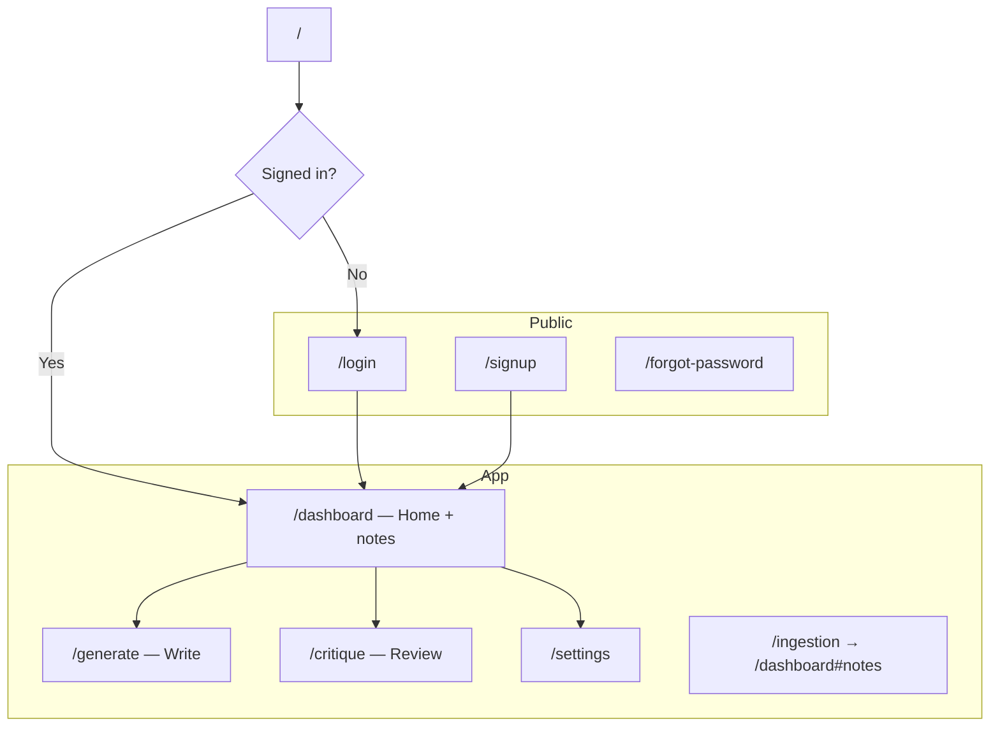

# Writr

A writing companion for authors. Upload notes, rewrite story drafts, and get feedback on scenes, scripts, story bibles, character sheets, and other story documents.

Writr is **cloud-only**: writers sign in with Supabase; notes and Write/Review go through your hosted FastAPI. There is no Ollama, no “This device” mode, and no local app address.

---

## Table of contents

- [Overview](#overview)
- [How it works](#how-it-works)
- [Features](#features)
- [Tech stack](#tech-stack)
- [Project structure](#project-structure)
- [Database & storage (Supabase)](#database--storage-supabase)
- [Getting started](#getting-started)
- [Routes](#routes)
- [Design system](#design-system)
- [License](#license)

---

## Overview

Writr helps writers keep research close while they write and revise:

1. **Notes library** (Dashboard) – upload character sheets, lore, research, and style notes. Notes are saved to the writer’s account and prepared in Supabase (pgvector).
2. **Write** – open a story draft for this session and ask Writr to rewrite it using your notes. The draft is sent only with the Write request — never stored as a library note.
3. **Review** – paste any story document (scene, script, story bible, character notes, and more) and get focused feedback. Pasted text is request-only.
4. **Settings** – tune Write and Review writing style (presets, instructions, creativity, length, notes used).

The UI is written for non-technical writers: plain labels, clear empty states, and mobile-friendly layouts.

---

## How it works

| What | Where | Embedded in notes library? |
| :--- | :--- | :--- |
| Reference notes (lore, research, character sheets) | Dashboard → Notes library → `POST /cloud/references/upload` | Yes – prepared for Write and Review |
| Story draft (active manuscript for rewrite) | Write → `POST /cloud/run` | No – session only (`target_stored: false`) |
| Text to critique (scene, script, bible, etc.) | Review (paste-in) → `POST /cloud/run` | No – reviewed in place |

Model API keys (Gemini / Groq / OpenAI) live on the backend. The browser never stores them. Every API call sends the Supabase access token as `Authorization: Bearer …`.

`/ingestion` redirects to `/dashboard#notes` (compat route; notes live on the Dashboard).

---

## Features

### Auth & profile
- Email/password auth via Supabase, with session persistence
- Signup with optional avatar upload (JPEG, PNG, WebP, up to 5MB)
- Password reset flow
- Protected app routes; public-only login/signup when already signed in

### Home (Dashboard)
- Notes library with drag-and-drop or **Choose files**
- Progress while notes are prepared (“Preparing notes…” — embeddings in Supabase)
- Shortcuts to **Write** and **Review**
- Always **Cloud** status and hosted model label

### Write (`/generate`)
- Upload one story file for the session (not added to the notes library)
- Read-only list of connected notes, with links to add more on the Dashboard
- Prompt chips + rewrite using your notes
- Copy revised text

### Review (`/critique`)
- Paste scenes, scripts, story bibles, character sheets, lore, or other story docs
- Focus options that work across doc types:
  - **Structure** – order, gaps, how pieces fit
  - **Flow** – clarity and pacing
  - **Voice** – tone vs your notes
  - **Line polish** – wording cleanup
- Score meters and concrete “Try this” suggestions

### Settings (`/settings`)
- Cloud-only: notes and writing run in the cloud (no local setup)
- Writing style for Write and Review: presets, instructions, creativity, length, notes used
- Advanced options (word variety, avoid repeats) behind **More options**
- Account / sign out via the nav menu

Embedding model is not a user setting — the backend pins it (e.g. Gemini embeddings).

### Navigation
- Desktop: Home · Write · Review
- Mobile drawer with the same destinations
- Theme toggle (and `d` keyboard shortcut)
- Avatar menu: settings and sign out

---

## Tech stack

| Layer | Technology |
| :--- | :--- |
| App | React 19, Vite 8, TypeScript |
| Auth & data | Supabase (Auth, Postgres, Storage, RLS, pgvector) |
| API | Hosted FastAPI (`VITE_API_URL`) |
| Data fetching | TanStack Query v5 |
| Routing | React Router DOM v7 |
| UI | Tailwind CSS v4, shadcn/ui (Base UI), Lucide icons |
| Forms | React Hook Form + Zod 4 |
| Fonts | IBM Plex Sans Variable |

---

## Project structure

```text
write/
├── src/
│   ├── components/
│   │   ├── ui/                 # shadcn / Base UI primitives
│   │   ├── app-nav.tsx         # Top navigation + mobile drawer
│   │   ├── embedding-monitor.tsx
│   │   ├── upload-confirm-dialog.tsx
│   │   ├── login-form.tsx / signup-form.tsx
│   │   └── ...
│   ├── contexts/
│   │   ├── auth-context.tsx
│   │   ├── corpus-context.tsx  # Notes library state + prepare pipeline
│   │   └── settings-context.tsx
│   ├── lib/
│   │   ├── api-client.ts       # JWT + /cloud/* calls
│   │   └── supabase.ts
│   ├── pages/
│   ├── types/
│   └── ...
├── .env                        # VITE_SUPABASE_* + VITE_API_URL
└── README.md
```

---

## Database & storage (Supabase)

Notes embeddings are stored via the FastAPI `/cloud` routes into Supabase pgvector. Auth profiles and avatars:

### Profiles table

```sql
create table public.profiles (
  id uuid references auth.users on delete cascade primary key,
  author_name text,
  email text,
  avatar_url text,
  updated_at timestamp with time zone default now()
);

alter table public.profiles enable row level security;

create policy "Public profiles are viewable by everyone."
  on public.profiles for select
  using (true);

create policy "Users can insert their own profile."
  on public.profiles for insert
  to authenticated
  with check (((select auth.uid()) = id));

create policy "Users can update own profile."
  on public.profiles for update
  to authenticated
  using (((select auth.uid()) = id))
  with check (((select auth.uid()) = id));
```

### Auth trigger

Creates a profile row when a user signs up:

```sql
create or replace function public.handle_new_user()
returns trigger
language plpgsql
security definer
set search_path = ''
as $$
begin
  insert into public.profiles (id, author_name, email, avatar_url)
  values (
    new.id,
    coalesce(new.raw_user_meta_data->>'author_name', new.raw_user_meta_data->>'full_name', ''),
    new.email,
    coalesce(new.raw_user_meta_data->>'avatar_url', '')
  );
  return new;
end;
$$;

create trigger on_auth_user_created
  after insert on auth.users
  for each row execute function public.handle_new_user();

revoke execute on function public.handle_new_user() from public;
revoke execute on function public.handle_new_user() from anon, authenticated;
```

### Avatars bucket

```sql
insert into storage.buckets (id, name, public, file_size_limit, allowed_mime_types)
values (
  'avatars',
  'avatars',
  true,
  5242880,
  array['image/jpeg', 'image/png', 'image/webp']
)
on conflict (id) do update set
  public = true,
  file_size_limit = 5242880,
  allowed_mime_types = array['image/jpeg', 'image/png', 'image/webp'];

create policy "Public Access for avatars"
  on storage.objects for select
  to public
  using (bucket_id = 'avatars');

create policy "Authenticated users can upload avatar"
  on storage.objects for insert
  to authenticated
  with check (
    bucket_id = 'avatars' and
    (storage.foldername(name))[1] = (select auth.uid())::text
  );

create policy "Authenticated users can update avatar"
  on storage.objects for update
  to authenticated
  using (
    bucket_id = 'avatars' and
    (storage.foldername(name))[1] = (select auth.uid())::text
  )
  with check (
    bucket_id = 'avatars' and
    (storage.foldername(name))[1] = (select auth.uid())::text
  );

create policy "Authenticated users can delete avatar"
  on storage.objects for delete
  to authenticated
  using (
    bucket_id = 'avatars' and
    (storage.foldername(name))[1] = (select auth.uid())::text
  );
```

---

## Getting started

### Prerequisites

- [Node.js](https://nodejs.org/) 20+ (or a compatible package runner)
- A [Supabase](https://supabase.com/) project
- A hosted FastAPI backend (or local FastAPI while developing)

### Environment

Create a `.env` in the project root:

```env
VITE_SUPABASE_URL=https://<your-project-ref>.supabase.co
VITE_SUPABASE_PUBLISHABLE_KEY=sb_publishable_<your-key>
VITE_API_URL=https://<your-hosted-fastapi>
```

Local frontend + local backend while developing:

```env
VITE_API_URL=http://127.0.0.1:8000
```

`VITE_API_URL` is required for live uploads and Write/Review. Set `VITE_USE_MOCK=true` to force mock responses for UI-only work (even if `VITE_API_URL` is present). Do not use mocks in production.

Legacy `VITE_SUPABASE_ANON_KEY` is still accepted as a fallback.

### Install & run

```bash
npm install
npm run dev
```

| Script | Description |
| :--- | :--- |
| `npm run dev` | Vite dev server |
| `npm run build` | Typecheck + production build |
| `npm run preview` | Preview production build |
| `npm run typecheck` | TypeScript only |
| `npm run lint` | ESLint |
| `npm run format` | Prettier |

---

## Routes



| Path | Purpose |
| :--- | :--- |
| `/dashboard` | Home, notes library (`#notes`) |
| `/generate` | Write – session story draft + rewrite |
| `/critique` | Review – feedback on any story document |
| `/settings` | Cloud + writing style |
| `/ingestion` | Redirect to notes library |

---

## Design system

Configured in `src/index.css` (Tailwind v4 + shadcn):

- OKLCH violet primary and semantic tokens (`background`, `foreground`, `muted`, …)
- Shared radius via `--radius` (buttons, inputs, badges, cards)
- Light and dark themes; press `d` to toggle
- Prefer semantic utilities (`bg-primary`, `text-muted-foreground`) over raw colors

---

## License

MIT – see [LICENSE](LICENSE) if present in the repo.
