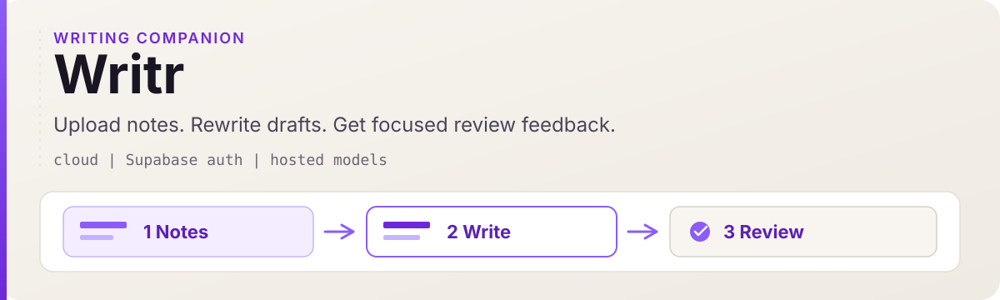

<p align="center">
  
</p>

# Writr

Writing companion for authors. Sign in with Supabase, keep your lore in a notes library, rewrite a draft against that context, and get focused review feedback. Model API keys stay on the server.

[Getting started](#getting-started) · [What it does](#what-it-does) · [Packages](#packages) · [Configuration](#configuration)

## Getting started

**You need**

- [Node.js 20+](https://nodejs.org/) or [Bun](https://bun.sh/)
- [uv](https://docs.astral.sh/uv/) and Python 3.14+
- A [Supabase](https://supabase.com/) project with [`docs/supabase-schema.sql`](docs/supabase-schema.sql) applied (enable **pgvector** first)
- A Gemini API key (`GEMINI_API_KEY`) for live inference and embeddings

### 1. Supabase

1. Create a project and enable **pgvector**.
2. Run [`docs/supabase-schema.sql`](docs/supabase-schema.sql) in the SQL editor.
3. Copy the project URL and publishable (anon) key.

### 2. Backend

```bash
cd write-backend
# add write-backend/.env — see Configuration
uv sync
uv run fastapi dev main.py
```

API: http://127.0.0.1:8000 · Docs: http://127.0.0.1:8000/docs · Health: http://127.0.0.1:8000/health

### 3. Web app

```bash
cd write
# add write/.env — see Configuration
bun install
bun run dev
```

Open the URL Vite prints (default http://localhost:5173), sign up, upload a note on Home, then try Write or Review.

> [!TIP]
> For UI-only work, set `VITE_USE_MOCK=true` in `write/.env`. Do not ship that flag.

## What it does

Writr is **cloud-only**. Writers authenticate with Supabase; notes, Write, and Review go through the FastAPI backend. Live calls send `Authorization: Bearer <supabase access token>`. There is no local / Ollama path.

| Screen | What you do |
| :--- | :--- |
| **Home** (`/dashboard`) | Upload reference notes (PDF, DOCX, TXT, MD) |
| **Write** (`/generate`) | Rewrite a session draft using your notes + style settings |
| **Review** (`/critique`) | Paste a scene / bible / character sheet; get scores and suggestions |
| **Settings** | Hosted model badge, Write/Review presets, sampling (stored in `localStorage`) |

```text
Browser (write/) ──JWT──▶ FastAPI (write-backend/) ──▶ Supabase + hosted models
```

## Packages

| Folder | Role |
| :--- | :--- |
| [`write/`](write/) | Product UI — React 19, Vite 8, TypeScript, Tailwind v4, shadcn/ui |
| [`write-backend/`](write-backend/) | FastAPI — auth, ingest, embeddings, inference |
| [`writr-desktop/`](writr-desktop/) | Tauri 2 shell (starter; not wired to the product UI yet) |

### Web scripts

```bash
cd write
bun run dev          # Vite
bun run build        # typecheck + production build
bun run typecheck    # tsc --noEmit
bun run lint         # ESLint
bun run format       # Prettier
```

### Backend surface

Protected routes expect a Supabase JWT. Check Swagger at `/docs` for the live API. Upload ingest is `POST /upload/{text,document,documents,link}` (202 + queued job). On long-lived hosts a worker claims jobs in-process; on Vercel that loop is off and Supabase Cron + `pg_net` hits `GET /internal/drain-jobs` instead (see `docs/supabase-drain-cron.sql`).

### Desktop

```bash
cd writr-desktop
bun install
bun run tauri dev
```

Needs a Rust toolchain and [Tauri OS prerequisites](https://tauri.app/start/prerequisites/). Product screens live in `write/`; this window is not connected yet.

## Configuration

### Web — `write/.env`

```env
VITE_SUPABASE_URL=https://<project-ref>.supabase.co
VITE_SUPABASE_PUBLISHABLE_KEY=sb_publishable_<key>
VITE_API_URL=http://127.0.0.1:8000
```

| Variable | Required | Purpose |
| :--- | :--- | :--- |
| `VITE_SUPABASE_URL` | yes | Supabase project URL |
| `VITE_SUPABASE_PUBLISHABLE_KEY` | yes | Publishable / anon key (`VITE_SUPABASE_ANON_KEY` is a fallback) |
| `VITE_API_URL` | for live API | FastAPI origin, no path suffix |
| `VITE_USE_MOCK` | no | `true` = simulated uploads / rewrites |

### Backend — `write-backend/.env`

```env
ENVIRONMENT=development
PORT=8000

SUPABASE_URL=https://<project-ref>.supabase.co
SUPABASE_PUBLISHABLE_KEY=your-publishable-key
SUPABASE_SECRET_KEY=your-secret-key

# Required so Supabase Cron can drain background_jobs on Vercel
CRON_SECRET=generate-a-long-random-string

GEMINI_API_KEY=
# Optional overrides. Defaults: gemini-3.8-flash, gemini-embedding-2, 768.
# MODEL_NAME=gemini-3.8-flash
# GEMINI_EMBEDDING_MODEL=gemini-embedding-2
# EMBEDDING_DIM=768
```

Legacy `SUPABASE_ANON_KEY` / `SUPABASE_SERVICE_ROLE_KEY` still work. Chat and embeddings use `GEMINI_API_KEY`. The app starts without it; the first model call fails until it is set. Keep `EMBEDDING_DIM` (default `768`) aligned with the `pgvector` column.

### Background job drain (Supabase Cron)

Hobby Vercel only allows daily Vercel Cron, so Writr drains like Pantra:

1. Set `CRON_SECRET` on the Vercel API project (same value in production).
2. In the Writr Supabase SQL editor, store it in Vault:
   `select vault.create_secret('YOUR_CRON_SECRET', 'writr_cron_secret');`
3. Apply [`docs/supabase-drain-cron.sql`](docs/supabase-drain-cron.sql) — schedules `trigger-writr-drain-jobs` every minute via `pg_cron` → `pg_net` → `GET /internal/drain-jobs`.

If Deployment Protection blocks the call, use a production custom domain (recommended) or add a Vercel automation bypass header in the SQL function. A local `uvicorn` worker still works when you are developing offline.

> [!IMPORTANT]
> CORS currently allows every origin. Narrow `allow_origins` in `write-backend/main.py` before production.

## Repository layout

```text
writr/
├── assets/readme/             # README visuals
├── docs/supabase-schema.sql   # profiles, avatars, reference_chunks
├── write/                     # product UI
│   └── src/
│       ├── pages/             # auth, dashboard, write, review, settings
│       ├── components/
│       ├── contexts/          # auth, corpus, settings
│       └── lib/               # api-client, supabase
├── write-backend/
│   ├── main.py
│   ├── router/                # HTTP routes
│   ├── services/              # supabase, chunking, embeddings, queue
│   └── core/config.py
└── writr-desktop/             # Tauri starter
```

## Supabase

Schema source of truth: [`docs/supabase-schema.sql`](docs/supabase-schema.sql).

- **profiles** — `author_name`, `email`, `avatar_url` (signup trigger)
- **avatars** — public bucket, 5MB, JPEG/PNG/WebP, path prefixed by user id
- **reference_chunks** — note text + `embedding vector(768)` for retrieval

The web app reads `profiles` directly. Note ingest and embeddings go through the backend.

## Design

Tokens live in `write/src/index.css` (Tailwind v4 / shadcn, violet primary, IBM Plex Sans). Prefer semantic utilities (`bg-primary`, `text-muted-foreground`). Theme follows system preference; press `d` when not typing in a field to toggle.
