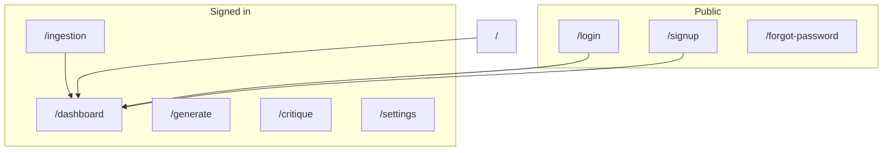

# Writr

A writing companion for authors. Upload notes, rewrite a story draft, and get feedback on scenes, scripts, story bibles, character sheets, and other story documents.

Writr is **cloud-only**. Writers sign in with Supabase. Notes, Write, and Review go through the FastAPI backend. There is no local model, no Ollama path, and no “this device” mode. Model API keys stay on the server. Every live API call sends the Supabase access token as `Authorization: Bearer …`.

This file is the project README. It covers the web app (`write/`), the API (`write-backend/`), and the desktop shell (`writr-desktop/`).

## Contents

- [Packages](#packages)
- [What you can do](#what-you-can-do)
- [How data moves](#how-data-moves)
- [Tech stack](#tech-stack)
- [Repository layout](#repository-layout)
- [Routes](#routes)
- [API the web app calls](#api-the-web-app-calls)
- [Auth and profiles](#auth-and-profiles)
- [Settings](#settings)
- [Supabase](#supabase)
- [Getting started](#getting-started)
- [Web app](#web-app)
- [Backend](#backend)
- [Desktop](#desktop)
- [Design](#design)
- [License](#license)

## Packages

| Folder | Role | Status |
| :--- | :--- | :--- |
| [`write/`](write/) | Browser UI (React, Vite, TypeScript) | Product |
| [`write-backend/`](write-backend/) | FastAPI API | Product |
| [`writr-desktop/`](writr-desktop/) | Tauri 2 desktop shell | Starter template |

The desktop window does not load the product UI. Product screens live in `write/`.

```text
writr/
├── write/            # browser app → VITE_API_URL
├── write-backend/    # FastAPI on :8000
└── writr-desktop/    # Tauri window on :1420
```

## What you can do

### Auth and profile

- Email and password sign-in, sign-up, and password reset through Supabase Auth.
- Sign-up collects an author name (2–100 characters) and a password of at least 8 characters.
- Optional avatar on sign-up: JPEG, PNG, or WebP, up to 5MB, stored in the `avatars` bucket under the user’s id.
- Session persistence via the Supabase client. Signed-in users are redirected away from `/login`, `/signup`, and `/forgot-password`. App routes require a session.
- Profile row is read from `public.profiles` (`author_name`, `email`, `avatar_url`).

### Home (`/dashboard`)

- Notes library with drag-and-drop or **Choose files**.
- Accepted picker types: `.pdf`, `.docx`, `.txt`, `.md`, `.epub`. The backend loader extracts `.pdf`, `.docx`, `.txt`, and `.md`.
- Confirm dialog before a file is added. Uploads are always reference notes.
- Progress while a note is prepared (“Preparing notes…”).
- Delete a note, or refresh the library.
- Shortcuts to Write and Review.
- Cloud status and the hosted model label from Settings.
- The page opens with a few sample notes already in memory so the library is not empty on first paint. New uploads go through the API.

### Write (`/generate`)

- One story file for this session (`.md`, `.txt`, `.docx`, `.pdf`, `.epub`). It is not added to the notes library.
- Prompt chips: deepen feelings, add sensory detail, sharpen dialogue, tighten pacing, match notes and lore.
- Rewrite uses the notes library plus the writing-style config (instructions, creativity, length, notes used, and advanced sampling).
- Copy the revised text. The response includes word count, character count, tokens, latency, and which notes were referenced.

### Review (`/critique`)

- Paste a scene, script, story bible, character sheet, lore note, or other story document. Two sample texts are built in.
- Focus (lenses), each with its own preset:
  - **Structure** — order, gaps, how pieces fit
  - **Flow** — clarity and pacing
  - **Voice** — tone against your notes
  - **Line polish** — wording cleanup
- Score meters (overall, pacing, voice, friction) and concrete “Try this” suggestions with a severity and a revised example.
- Pasted text is sent with `target_stored: false` and `mode: "review"`.

### Settings (`/settings`)

- Cloud card: notes and writing run in the cloud. The badge shows the active hosted model.
- Separate Write and Review style:
  - Presets (Literary, Tension, World & place, Inner life for Write; the four Review lenses)
  - Writing instructions, with insert tags: Your notes, Your voice, Story draft, Pacing guide
  - Creativity (temperature), length (max tokens), notes used (context chunks)
  - **More options**: top-p and word variety (frequency penalty)
- Values persist in `localStorage` under `writr_settings_v1`. They are not synced to Supabase. Legacy local/Ollama fields are stripped on load.
- Allowed hosted providers in stored settings: Gemini, Groq, OpenAI, OpenRouter. Anything else, including a stored `ollama` value, falls back to Gemini (`gemini-2.5-pro`).

### Navigation

- Desktop: Home, Write, Review.
- Mobile drawer with the same destinations.
- Theme toggle. Press `d` to switch light and dark (ignored while typing in a field).
- Avatar menu: Settings and sign out.
- A violet accent stripe sits on the sticky header.

## How data moves

| What | Where it lives | Sent to the API as |
| :--- | :--- | :--- |
| Reference notes (lore, research, character sheets) | Notes library on the Dashboard | `POST /cloud/references/upload` (multipart file) |
| Story draft for a rewrite | Write page, this session only | `POST /cloud/run` with `target_stored: false` |
| Text to critique | Review page, pasted in the form | `POST /cloud/run` with `mode: "review"` and `target_stored: false` |
| Writing style | `localStorage` | Fields on the Write/Review body (`temperature`, `max_tokens`, `top_p`, `frequency_penalty`, `context_chunks`, `system_prompt`) |

`/ingestion` redirects to `/dashboard#notes` (`#corpus` also scrolls to the notes section).

If `VITE_API_URL` is missing and `VITE_USE_MOCK` is not `true`, uploads and Write/Review throw `ApiConfigError`. With `VITE_USE_MOCK=true`, uploads and rewrites return simulated data and Review returns an empty payload so the page can keep its local sample report. Do not ship mocks.

Reference notes are meant to be chunked, embedded, and stored in Supabase `pgvector`. Write and Review session documents stay request-scoped and come back as copiable text.

## Tech stack

| Layer | Technology |
| :--- | :--- |
| Web UI | React 19, Vite 8, TypeScript 6 |
| Desktop shell | Tauri 2, Rust, React 19, Vite 8 |
| Auth and profiles | Supabase JS (`@supabase/supabase-js`) |
| Server data | TanStack Query v5 |
| Routing | React Router DOM v7 |
| Styling | Tailwind CSS v4, shadcn/ui (`base-sera`), Base UI, Lucide |
| Forms | React Hook Form, Zod 4 |
| Font | IBM Plex Sans Variable |
| API | FastAPI, Python 3.14+, [uv](https://docs.astral.sh/uv/) |
| Models | LangChain / LangGraph — Gemini, OpenAI, Groq, OpenRouter |
| Notes storage | Supabase Auth, Postgres, `pgvector` |
| Documents | PDF (`pypdf`), DOCX (`docx2txt`), plain text, Markdown, URL pages |

In `write/`, the path alias `@` points at `src/` (see `vite.config.ts`).

## Repository layout

```text
writr/
├── README.md
├── write/                         # product UI
│   ├── index.html
│   ├── components.json            # shadcn (style: base-sera, icons: lucide)
│   ├── vite.config.ts
│   ├── package.json
│   ├── .env                       # not committed
│   └── src/
│       ├── main.tsx               # ThemeProvider + App
│       ├── App.tsx                # providers + routes
│       ├── index.css              # Tailwind v4 tokens
│       ├── pages/
│       │   ├── LoginPage.tsx
│       │   ├── SignupPage.tsx
│       │   ├── ForgotPasswordPage.tsx
│       │   ├── DashboardPage.tsx
│       │   ├── GeneratePage.tsx
│       │   ├── CritiquePage.tsx
│       │   ├── SettingsPage.tsx
│       │   ├── NotFoundPage.tsx
│       │   └── settings/          # presets + zod schema
│       ├── components/
│       │   ├── ui/                # shadcn / Base UI primitives
│       │   ├── app-nav.tsx
│       │   ├── login-form.tsx
│       │   ├── signup-form.tsx
│       │   ├── avatar-upload.tsx
│       │   ├── upload-confirm-dialog.tsx
│       │   ├── embedding-monitor.tsx
│       │   ├── protected-route.tsx
│       │   └── theme-provider.tsx
│       ├── contexts/
│       │   ├── auth-context.tsx
│       │   ├── corpus-context.tsx
│       │   └── settings-context.tsx
│       ├── lib/
│       │   ├── api-client.ts      # JWT + /cloud/* (+ mock path)
│       │   ├── supabase.ts
│       │   ├── model-providers.ts
│       │   └── query-client.ts
│       └── types/
│           ├── auth.ts
│           ├── document-roles.ts
│           └── settings.ts
├── write-backend/
│   ├── main.py                    # app, CORS, / and /health
│   ├── pyproject.toml
│   ├── .env                       # not committed
│   ├── router/
│   │   └── cloud/                 # /cloud, JWT required, request schemas
│   ├── services/
│   │   ├── supabase.py            # clients + current user
│   │   ├── doc_loader.py          # pdf, docx, txt, md, URL
│   │   ├── chunking.py            # split notes for embeddings
│   │   └── embeddings.py          # Gemini, OpenAI fallback
│   ├── core/
│   │   └── config.py              # Pydantic settings from .env
│   └── utils/
│       └── log.py
└── writr-desktop/
    ├── index.html
    ├── package.json
    ├── src/                       # Tauri + React starter UI
    └── src-tauri/                 # Rust app, identifier com.writr.app
```

Provider order in the web `App`: QueryClient → Auth → Settings → Corpus → BrowserRouter.

## Routes


```mermaid
graph TD
  A["/"] --> C["/dashboard"]
  D["/login"] --> C
  E["/signup"] --> C

  subgraph Public
    D
    E
    F["/forgot-password"]
  end

  subgraph SignedIn["Signed in"]
    C["/dashboard"]
    G["/generate"]
    H["/critique"]
    S["/settings"]
    I["/ingestion"]
  end

  I --> C
```

| Path | Access | Page |
| :--- | :--- | :--- |
| `/` | anyone | Redirects to `/dashboard` |
| `/login` | signed out | Sign in |
| `/signup` | signed out | Create account |
| `/forgot-password` | signed out | Email reset |
| `/dashboard` | signed in | Home and notes library |
| `/generate` | signed in | Write |
| `/critique` | signed in | Review |
| `/settings` | signed in | Cloud status and writing style |
| `/ingestion` | signed in | Redirect to `/dashboard#notes` |
| anything else | anyone | Not found |

## API the web app calls

Base URL is `VITE_API_URL` with a trailing slash removed. Live calls require a Supabase session.

The process also exposes:

| Method | Path | Auth | Purpose |
| :--- | :--- | :--- | :--- |
| `GET` | `/` | no | Welcome check |
| `GET` | `/health` | no | Liveness probe |
| `GET` | `/docs` | no | Swagger |
| `GET` | `/redoc` | no | ReDoc |

`/cloud` routes are mounted with a Supabase JWT dependency.

### `POST /cloud/references/upload`

Multipart field `file`. Used only for reference notes. A `target` role throws in the client before the request.

### `POST /cloud/run` (Write)

JSON when the draft text is already in memory:

```json
{
  "instruction": "Sharpen dialogue",
  "target_text": "…",
  "target_filename": "chapter.md",
  "target_file_id": "…",
  "target_stored": false,
  "temperature": 0.7,
  "max_tokens": 2048,
  "top_p": 0.9,
  "frequency_penalty": 1.1,
  "context_chunks": 5,
  "system_prompt": "…"
}
```

If the page only has a `File` and no extracted text, the same endpoint is called as multipart (`instruction`, `file`, and the numeric fields that are set).

Expected JSON shape (`GenerateRevisionsResponse`): `target_file_id`, `target_filename`, `revised_text`, `word_count`, `character_count`, `tokens`, `latency_ms`, `referenced_documents`.

### `POST /cloud/run` (Review)

```json
{
  "instruction": "…",
  "target_text": "…",
  "target_stored": false,
  "mode": "review",
  "temperature": 0.3,
  "max_tokens": 1536,
  "context_chunks": 4,
  "system_prompt": "…"
}
```

The page reads `report_text`, `score_overall`, `pacing_score`, `voice_score`, `friction_score`, and `recommendations[]` (`category`, `severity`, `issue`, `revised_example`). An empty JSON object leaves the local sample report in place.

### Reference schemas

`write-backend/router/cloud/schemas.py` models the notes the API stores and retrieves:

| Model | Fields |
| :--- | :--- |
| `ReferenceDocumentRead` | `id`, `owner_id`, `name`, `visibility` (`catalog` \| `private`), `storage_path`, `chunk_count`, `embedding_status` (`pending` \| `ready` \| `failed`), `created_at` |
| `ReferenceChunkRead` | `id`, `document_id`, `owner_id`, `visibility`, `chunk_index`, `content`, `metadata`, `created_at` |
| `ReferenceIn` | `texts` (at least one non-empty string), optional `filename` and `name` |
| `ReferenceOut` | `document`, `ids`, `count`, `embedding_model` |
| `MatchRequest` | `query`, `match_count` (1–50, default 8), `filter` |
| `MatchResponse` | `embedding_model`, `count`, `matches` (`id`, `content`, `metadata`, `similarity`) |

## Auth and profiles

`write/src/lib/supabase.ts` creates the client from `VITE_SUPABASE_URL` and `VITE_SUPABASE_PUBLISHABLE_KEY` (fallback: `VITE_SUPABASE_ANON_KEY`). The app throws at startup if either is missing.

`AuthProvider` loads the session, subscribes to `onAuthStateChange`, and fetches `profiles` with TanStack Query. Sign-up uploads the avatar when a file is present, then stores `author_name` and `avatar_url` on the user metadata so the profile trigger can copy them.

On the server, `services/supabase.py` provides:

- A sync and an async client signed with the publishable key.
- A service async client signed with the secret key (bypasses row level security). Filter by owner yourself when you use it.
- A per-request user client that forwards the caller’s JWT so row level security applies.
- `get_current_user`, which validates `Authorization: Bearer …` and returns the Supabase user. Missing or invalid tokens are rejected.

## Settings

Stored shape (`AppSettings`) in the browser:

| Field | Meaning |
| :--- | :--- |
| `storageMode` | Always `"default"` (cloud) |
| `modelProvider` | `gemini` \| `groq` \| `openai` \| `openrouter` |
| `geminiModel` | Display name for the Gemini chat model, default `gemini-2.5-pro` |
| `generateConfig` | Write instructions and sampling |
| `critiqueConfig` | Review instructions and sampling |

Each workflow config: `systemPrompt`, `temperature` (0–1.5), `maxTokens` (256–4096), `topP` (0.1–1), `frequencyPenalty` (1–1.5), `contextChunks` (1–10).

The nav and Dashboard badge (`activeModelDisplayName`) shows `Gemini — <model>`, or `Groq — hosted`, `OpenAI — hosted`, `OpenRouter — hosted`.

Embedding model choice is not a user setting. The backend picks it.

Backend defaults (`write-backend/core/config.py`):

| Setting | Default |
| :--- | :--- |
| `ENVIRONMENT` | `development` |
| `PORT` | `8000` |
| `GEMINI_EMBEDDING_MODEL` | `gemini-embedding-2` |
| `OPENAI_EMBEDDING_MODEL` | `text-embedding-3-small` |
| `EMBEDDING_DIM` | `768` (must match the `pgvector` column) |
| `CHUNK_SIZE` | `800` characters |
| `CHUNK_OVERLAP` | `150` |
| `ATOMIC_MAX` | `2400` (below this token estimate the chunker uses the record profile) |
| `MIN_CHUNK` | `480` (shorter tails are merged) |

Provider keys are optional at startup. A call fails when it needs a key that is missing. Gemini embeddings are preferred when `GEMINI_API_KEY` is set. OpenAI embeddings are the fallback when only `OPENAI_API_KEY` is set.

The chunker normalizes text, picks a profile (atomic, record, structured, or prose), splits, then merges tiny tails. The document loader accepts a file path, raw bytes, pasted text, or an `http`/`https` URL. URL pages shorter than 200 characters are treated as empty shells.

## Supabase

The web app reads `profiles` directly. Notes embeddings are written by the backend. Apply this SQL in the Supabase SQL editor for a new project. Enable `pgvector` on the project first.

### Profiles

```sql
create table public.profiles (
  id uuid references auth.users on delete cascade primary key,
  author_name text,
  email text,
  avatar_url text,
  updated_at timestamp with time zone default now()
);

alter table public.profiles enable row level security;

create policy "Public profiles are viewable by everyone."
  on public.profiles for select
  using (true);

create policy "Users can insert their own profile."
  on public.profiles for insert
  to authenticated
  with check ((select auth.uid()) = id);

create policy "Users can update own profile."
  on public.profiles for update
  to authenticated
  using ((select auth.uid()) = id)
  with check ((select auth.uid()) = id);
```

Trigger that creates a profile when a user signs up:

```sql
create or replace function public.handle_new_user()
returns trigger
language plpgsql
security definer
set search_path = ''
as $$
begin
  insert into public.profiles (id, author_name, email, avatar_url)
  values (
    new.id,
    coalesce(new.raw_user_meta_data->>'author_name', new.raw_user_meta_data->>'full_name', ''),
    new.email,
    coalesce(new.raw_user_meta_data->>'avatar_url', '')
  );
  return new;
end;
$$;

create trigger on_auth_user_created
  after insert on auth.users
  for each row execute function public.handle_new_user();

revoke execute on function public.handle_new_user() from public;
revoke execute on function public.handle_new_user() from anon, authenticated;
```

### Avatars bucket

```sql
insert into storage.buckets (id, name, public, file_size_limit, allowed_mime_types)
values (
  'avatars',
  'avatars',
  true,
  5242880,
  array['image/jpeg', 'image/png', 'image/webp']
)
on conflict (id) do update set
  public = true,
  file_size_limit = 5242880,
  allowed_mime_types = array['image/jpeg', 'image/png', 'image/webp'];

create policy "Public Access for avatars"
  on storage.objects for select
  to public
  using (bucket_id = 'avatars');

create policy "Authenticated users can upload avatar"
  on storage.objects for insert
  to authenticated
  with check (
    bucket_id = 'avatars'
    and (storage.foldername(name))[1] = (select auth.uid())::text
  );

create policy "Authenticated users can update avatar"
  on storage.objects for update
  to authenticated
  using (
    bucket_id = 'avatars'
    and (storage.foldername(name))[1] = (select auth.uid())::text
  )
  with check (
    bucket_id = 'avatars'
    and (storage.foldername(name))[1] = (select auth.uid())::text
  );

create policy "Authenticated users can delete avatar"
  on storage.objects for delete
  to authenticated
  using (
    bucket_id = 'avatars'
    and (storage.foldername(name))[1] = (select auth.uid())::text
  );
```

### Reference notes

```sql
create extension if not exists vector;

create table reference_chunks (
  id uuid primary key default gen_random_uuid(),
  content text not null,
  metadata jsonb default '{}'::jsonb,
  embedding vector(768)
);
```

`embedding vector(768)` must stay in step with `EMBEDDING_DIM`.

## Getting started

Run the API first, then the web app.

1. Create a Supabase project and run the SQL above.
2. Install [uv](https://docs.astral.sh/uv/) and Python 3.14+.
3. Configure and start `write-backend` (port 8000).
4. Install Node.js 20+ or [Bun](https://bun.sh/).
5. Configure `write/.env` with `VITE_API_URL=http://127.0.0.1:8000`.
6. Start the web app and sign in.
7. Upload notes on the Dashboard, then use Write or Review.

For a hosted API, set `VITE_API_URL` to that origin instead of `127.0.0.1`.

## Web app

### Prerequisites

- Node.js 20+ or Bun
- A Supabase project with the schema above
- The FastAPI backend, local or hosted

### Environment

Create `write/.env`:

```env
VITE_SUPABASE_URL=https://<your-project-ref>.supabase.co
VITE_SUPABASE_PUBLISHABLE_KEY=sb_publishable_<your-key>
VITE_API_URL=http://127.0.0.1:8000
```

| Variable | Required | Purpose |
| :--- | :--- | :--- |
| `VITE_SUPABASE_URL` | yes | Supabase project URL. Missing value crashes startup. |
| `VITE_SUPABASE_PUBLISHABLE_KEY` | yes | Publishable (anon) key. |
| `VITE_SUPABASE_ANON_KEY` | no | Fallback if the publishable key is unset. |
| `VITE_API_URL` | for live Write/Review | FastAPI origin, no path suffix. |
| `VITE_USE_MOCK` | no | Set to `true` to skip the live API. |

### Install and run

```bash
cd write
bun install
bun run dev
```

`npm install` and `npm run dev` work the same way. Open the URL Vite prints (default `http://localhost:5173`).

### Scripts

| Script | Description |
| :--- | :--- |
| `bun run dev` | Vite dev server |
| `bun run build` | `tsc -b` then production build to `dist/` |
| `bun run preview` | Serve the production build |
| `bun run typecheck` | `tsc --noEmit` |
| `bun run lint` | ESLint |
| `bun run format` | Prettier on `**/*.{ts,tsx}` |

## Backend

Cloud inference through Gemini, OpenAI, Groq, and OpenRouter. Cloud storage is Supabase Postgres plus `pgvector` for reference notes. Session drafts are not stored. Protected routes expect a Supabase JWT.

### Prerequisites

- Python 3.14+
- uv
- Supabase with `pgvector` enabled
- At least one model provider API key for the features you call

Install uv on Windows:

```powershell
powershell -ExecutionPolicy ByPass -c "irm https://astral.sh/uv/install.ps1 | iex"
```

### Environment

Create `write-backend/.env`:

```env
ENVIRONMENT=development
PORT=8000

SUPABASE_URL=https://your-project.supabase.co
SUPABASE_PUBLISHABLE_KEY=your-publishable-key
SUPABASE_SECRET_KEY=your-secret-key

GEMINI_API_KEY=your-gemini-key
OPENAI_API_KEY=your-openai-key
OPENROUTER_API_KEY=your-openrouter-key
GROQ_API_KEY=your-groq-key
```

Legacy `SUPABASE_ANON_KEY` and `SUPABASE_SERVICE_ROLE_KEY` are still accepted. Unknown env keys are ignored.

CORS in `main.py` allows every origin during development. Tighten `allow_origins` to the real frontend URL before production.

### Install and run

```bash
cd write-backend
uv sync
uv run fastapi dev main.py
```

Equivalent: `uvicorn main:app --reload --port 8000`.

- API: [http://127.0.0.1:8000](http://127.0.0.1:8000)
- Swagger: [http://127.0.0.1:8000/docs](http://127.0.0.1:8000/docs)
- ReDoc: [http://127.0.0.1:8000/redoc](http://127.0.0.1:8000/redoc)
- Health: [http://127.0.0.1:8000/health](http://127.0.0.1:8000/health)

## Desktop

`writr-desktop` is a Tauri 2 + React + TypeScript + Vite app.

| | |
| :--- | :--- |
| Product name | `writr-desktop` |
| Identifier | `com.writr.app` |
| Window | 800×600, title `writr-desktop` |
| Dev URL | `http://localhost:1420` (fixed; Vite fails if the port is taken) |
| Frontend build | `bun run build`, output `dist/` |
| Rust crate | `writr_desktop_lib` |
| Plugins | `tauri-plugin-opener` |
| Starter command | `greet` — returns a hello string from Rust |

The current UI is the Tauri starter (logos and a name field that calls `greet`). It is not wired to Supabase or to `write-backend`.

### Recommended editor setup

[VS Code](https://code.visualstudio.com/) with the [Tauri](https://marketplace.visualstudio.com/items?itemName=tauri-apps.tauri-vscode) and [rust-analyzer](https://marketplace.visualstudio.com/items?itemName=rust-lang.rust-analyzer) extensions.

### Prerequisites

- Bun or Node.js 20+
- A Rust toolchain
- The [Tauri prerequisites](https://tauri.app/start/prerequisites/) for your OS (on Windows, the Microsoft C++ build tools and WebView2)

### Install and run

```bash
cd writr-desktop
bun install
bun run tauri dev
```

`bun run dev` starts only the Vite frontend on port 1420. `bun run tauri build` produces installers (`beforeBuildCommand` runs `bun run build` first).

| Script | Description |
| :--- | :--- |
| `bun run dev` | Vite only, port 1420 |
| `bun run build` | Typecheck and production frontend build |
| `bun run preview` | Preview the frontend build |
| `bun run typecheck` | `tsc --noEmit` |
| `bun run lint` | ESLint |
| `bun run format` | Prettier on `**/*.{ts,tsx}` |
| `bun run tauri` | Tauri CLI (`dev`, `build`, …) |

Release builds in `src-tauri/Cargo.toml` use a single codegen unit, link-time optimization, `opt-level = 3`, `panic = abort`, and stripped symbols.

## Design

Tokens for the web app live in `write/src/index.css` (Tailwind v4, shadcn):

- OKLCH violet primary and semantic colors (`background`, `foreground`, `muted`, `card`, `border`).
- Shared radius via `--radius` on buttons, inputs, badges, and cards.
- Light and dark themes. `ThemeProvider` stores the choice and follows `prefers-color-scheme` when set to system. Press `d` to toggle.
- Prefer semantic utilities (`bg-primary`, `text-muted-foreground`) over raw colors.
- Layouts are mobile-friendly: the nav collapses to a drawer, and pages use `max-w-5xl` / `max-w-6xl` with safe-area padding.

## License

Private repository. All rights reserved.
